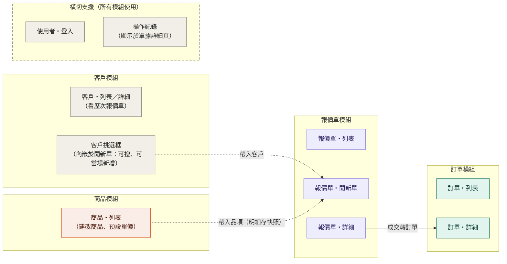
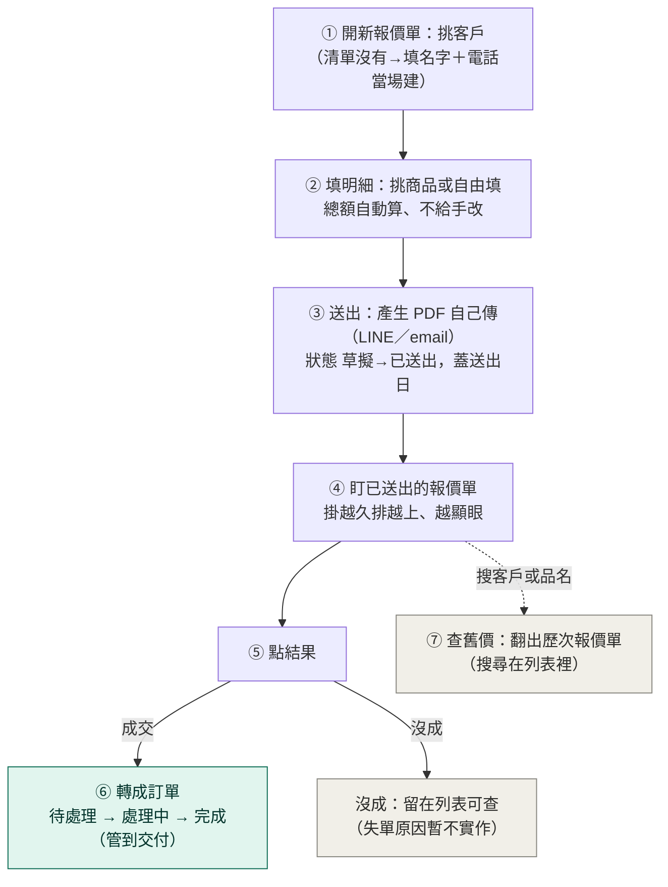
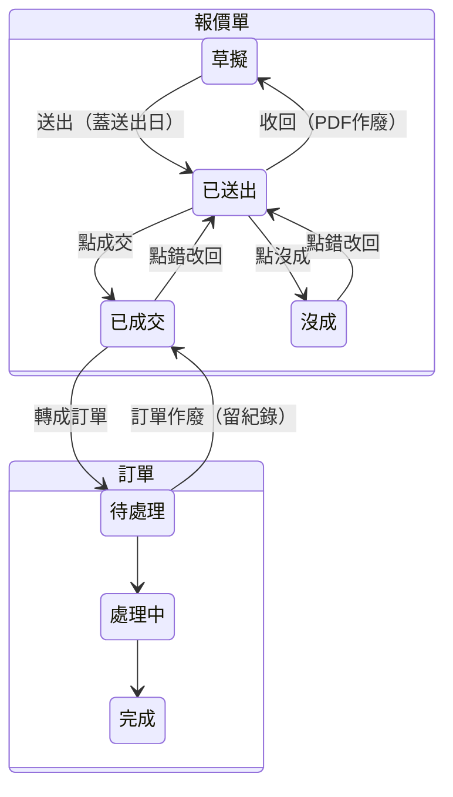

# 知識架構圖 — 報價單系統

> 狀態：⏳ 草稿待簽核（AI 依 [意圖定稿](意圖定稿.md) 起草；逐段勾完即成正本）
> 整個系統一頁看完。這裡只寫 **AI 猜不到的判斷**——CRUD、分頁、按鈕長怎樣都交給 AI，不寫在這。
> 這份變厚就是警訊：不是把常規抄進來了，就是把規格細節提前塞進來了（那是規格書的事）。

## 這個系統是什麼（四問）

- **給誰用**：你＋同事／業務幾個人（不開客戶入口）。
- **用來做什麼**：開報價單給客戶、查報過的價、盯已送出的報價單；成交的報價單轉成訂單、管到交付。
- **做完會得到**：舊價 30 秒答得出；該追的報價單一眼看見；開單 5 分鐘、PDF 拿得出手。
- **絕對不能發生**：①總額跟明細對不起來 ②送出的報價單被悄悄改 ③同事動別人的報價單而沒紀錄。

## 資料

| 東西 | 記什麼 | 跟誰有關 |
|---|---|---|
| **使用者** | 帳號、密碼（雜湊存放，不存明文）、顯示名稱 | 修改紀錄記它是誰；報價單負責人指向它 |
| **客戶** | 名稱、**電話（認人鍵，email 不強制）**、備註 | 被報價單與訂單引用（一個客戶多張單） |
| **商品** | 品名、預設單價、備註 | 被報價明細引用（來源商品，可空） |
| **報價單** | 單號、狀態、**負責人（＝開單的人）**、有效期限、付款條件、送出日、備註；**總額不存欄位、由明細現算** | 屬於一個客戶；有多行明細 |
| **報價明細** | 品名、數量、單價（**快照**，存自己的）、來源商品（可空：挑的就填、手打的就空） | 屬於一張報價單 |
| **訂單** | 單號、狀態、預計交付日 | 來自一張成交的報價單；有多行明細 |
| **訂單明細** | 品名、數量、單價 | 屬於一張訂單（轉單時從報價明細複製） |
| **修改紀錄** | 誰（→使用者）、何時、哪張單、改了什麼（含狀態退回） | 掛在報價單與訂單上 |

## 模組（照物件群切；「回頭挑下一個動作」看這張表）

### 模組×頁面圖

### 對照表

| 模組 | 資料 | 重要流程（CRUD 常規不展開） | 守哪些原則 | 規格書（狀態） |
|---|---|---|---|---|
| **使用者** | 使用者 | 登入／登出；帳號先由開發者手建（管理頁暫不實作） | 2、3 的「誰」由此而來 | 未切 |
| **客戶** | 客戶 | 列表／詳細（看歷次報價單）；開單挑選框搜／當場建 | 7 | 未切 |
| **商品** | 商品 | 列表建改（預設單價）；報價時挑或自由填（明細存快照） | 8 | 未切 |
| **報價單** | 報價單、報價明細 | 建單①②、送出＋產 PDF ③、盯單排序④、點結果⑤、查舊價⑦；退路：收回、點錯改回 | 1、6、8 | [建立報價單](建立報價單.md)（出廠範例，簽圖後校對）；其餘動作未切 |
| **訂單** | 訂單、訂單明細 | 轉單⑥（跨模組，自報價單）、推進狀態、作廢退路 | 5、6 | 未切 |
| **操作紀錄** | 修改紀錄 | 每筆單據改動自動寫入（誰、何時、改了什麼，含狀態退回）；在單據詳細頁查看 | 2、3、4 | 未切（顯示於各單據詳細頁） |

使用者與操作紀錄是橫切支援模組：所有模組使用，不畫連線網。資料、流程、原則的定義都在上面各段——這張表只對照引用，不重複定義。規格書檔頭掛錨「模組：〈模組名〉／動作：〈動作名〉」。

## 流程

### 主流程（整條一張圖）

退路（收回、點錯改回、訂單作廢）不畫在主流程上，見下方狀態圖。

### 狀態機（含退路）

**報價單**：`草擬` →（送出，蓋送出日）→ `已送出` →（點結果）→ `已成交` ｜ `沒成`
**訂單**（成交的報價單轉出）：`待處理` → `處理中` → `完成`

**退路（每一步都可退一格、退也留紀錄）**：
- `已送出` →（收回）→ `草擬`——客戶手上那份 PDF 視為作廢，重送出新版
- `已成交`／`沒成` →（點錯改回）→ `已送出`
- 訂單 →（作廢）→ 報價單回到 `已成交`（訂單留一筆作廢紀錄，不真刪）

- 送出後的報價單**可改**，每次修改記進修改紀錄（不鎖單）。
- 有效期限過了不跑排程改狀態，查詢時現算「剩幾天」。

## 頁面

| 頁面 | 上面做什麼 |
|---|---|
| 登入 | 帳號密碼登入——之後每個動作都記得到誰在操作 |
| 報價單・列表 | 狀態 tabs、搜尋（＝查舊價）、掛 N 天越排越上 |
| 報價單・開新單 | 挑客戶（沒有→當場建）、填明細（挑商品或自由填）、存草稿 |
| 報價單・詳細 | 改單、點結果、轉訂單、看修改紀錄 |
| 訂單・列表 | 依狀態看 |
| 訂單・詳細 | 推進狀態、作廢 |
| 客戶・列表／詳細 | 查客戶、看他歷次報價單（開單挑選框照舊能搜能建） |
| 商品・列表 | 建改商品、預設單價 |

## 原則（每條之後都要變成一個測試）

| # | 原則 | 守什麼 | 測試 |
|---|---|---|---|
| 1 | **總額＝明細加總**，不讓人手打 | 絕不能發生① | ⏳ 未寫 |
| 2 | **送出後的修改必留紀錄**——誰、何時、改了什麼；「悄悄改」不存在 | 絕不能發生② | ⏳ 未寫 |
| 3 | **動別人的報價單必留紀錄**（負責人以外的人改單） | 絕不能發生③ | ⏳ 未寫 |
| 4 | **狀態退回也是修改**——一樣留紀錄 | ②③的延伸 | ⏳ 未寫 |
| 5 | **已成交的報價單才轉訂單** | 流程正確 | ⏳ 未寫 |
| 6 | **單號唯一**（報價單、訂單各自唯一） | 單據可追 | ⏳ 未寫 |
| 7 | **被引用的客戶不能硬刪** | 資料完整 | ⏳ 未寫 |
| 8 | **報價明細存快照**——單上的品名價格存自己的；來源商品改名改價不回寫舊單 | 舊單不失真 | ⏳ 未寫 |

哪個角色能按哪顆鈕的細節不寫這裡——進各規格書的〈權限〉段。

## 現在不做（想清楚才不做，不是忘了）

通知／推播、掉出視線天數（做列表再定）、收款與對帳、訂金、失單原因、一張報價拆多張訂單、使用者管理頁（帳號就幾個，先由開發者手建）。

> 這些不是缺陷，是還沒痛到。真的痛了再長，長的時候先回來改這張圖。
